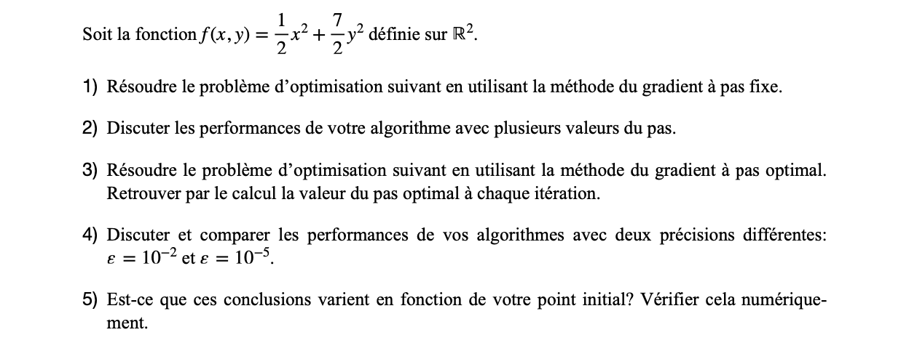

# RCP104 - Méthodes d'optimisation à base de gradient

## Exécution du jeu de test

Le jeu de test exécute l'algorithme dans deux modes :

- Méthode du gradient à pas fixe.
- Méthode du gradient à pas optimal.

```sh
# Install dependencies
go get

# Execute the algorithm
go run ex1.go
```

## Exercice 1



### 1. Méthode du gradient à pas fixe

L'algorithme de résolution avec la méthode du gradient à pas fixe est visible
dans le fichier `ex1.go`, [ici](https://github.com/remydt/rcp104-gradient/blob/main/ex1.go#L62).

Il faut configurer l'option `Method: "fixedStep"`. Et préciser le pas avec
le paramètre `LearningRate`.

_La fontion main() exécute un jeu de test._

### 2. Variations du pas

Le tableau suivant compare les performances de l'algorithme avec différentes
valeurs de pas :

| Pas  |   Durée   | Itérations | Valeur de x |    Valeur de y     |
| :--: | :-------: | :--------: | :---------: | :----------------: |
| 0.5  | 13.489µs  |     21     |  0.000003   | -1001159522.300886 |
| 0.25 |  50.54µs  |    101     |     0.0     |        0.0         |
| 0.01 | 867.683µs |    2023    |     0.0     |        0.0         |

Pour ces tests, la valeur d'epsilon (Ɛ) est fixée à 10e-5.

- Avec un pas de 0.5 (considéré trop grand), le nombre d'itérations est faible
  mais le minimum (x: 0, y: 0) n'est pas atteint. L'algorithme "loupe" le
  passage au minimum. On ne converge pas. L'algorithme s'arrête car le test de
  convergence est erroné.
- Avec un pas de 0.01 (considéré trop petit), la solution est atteinte
  mais le nombre d'itérations est élevé (et, par conséquent, la durée
  d'exécution). La convergence vers le minimum est très lente.
- Avec un pas de 0.25, le minimum est atteint et le nombre
  d'itérations est acceptable. Cela semble un bon compromis.

En cherchant une valeur plus précise, on s'aperçoit que l'on peut diminuer le
nombre d'itérations nécessaires avec un pas de 0.24 :

| Pas  |  Durée   | Itérations | Valeur de x | Valeur de y |
| :--: | :------: | :--------: | :---------: | :---------: |
| 0.24 | 49.287µs |     98     |     0.0     |     0.0     |

### 3. Méthode du gradient à pas optimal

L'algorithme de résolution avec la méthode du gradient à pas optimal est
visible dans le fichier `ex1.go`,
[ici](https://github.com/remydt/rcp104-gradient/blob/main/ex1.go#L68).

Il faut configurer l'option `Method: "optimalStep"`. Il n'est alors plus
nécessaire de préciser la valeur du paramètre `LearningRate`.

_La fontion main() exécute un jeu de test._

### 4. Variations de la précision (Ɛ)

Le tableau suivant compare les performances de l'algorithme du gradient à _pas
fixe_ avec deux valeurs d'epsilon :

|   Ɛ   |  Durée   | Itérations | Valeur de x | Valeur de y |
| :---: | :------: | :--------: | :---------: | :---------: |
| 10e-2 | 34.47µs  |     77     |     0.0     |     0.0     |
| 10e-5 | 32.147µs |    101     |     0.0     |     0.0     |

Pour ces tests, la valeur du pas est fixée à 0.25.

Le tableau suivant compare les performances de l'algorithme du gradient à _pas
optimal_ avec deux valeurs d'epsilon :

|   Ɛ   |  Durée   | Itérations | Valeur de x | Valeur de y |
| :---: | :------: | :--------: | :---------: | :---------: |
| 10e-2 | 27.973µs |     56     |     0.0     |     0.0     |
| 10e-5 | 42.626µs |     84     |     0.0     |     0.0     |

On remarque que l'algorithme à pas optimal est globalement plus performant que
celui à pas fixe. En revanche, une itération est plus "gourmande" en temps
d'exécution. Cela est dû au fait que l'algorithme doit calculer le pas pour
chaque itération.

### 5. Variations du point initial

Le tableau suivant compare les performances des algorithmes en fonction du point
initial choisi :

|   Méthode   |  x0  |  y0  |  Durée   | Itérations | Valeur de x | Valeur de y |
| :---------: | :--: | :--: | :------: | :--------: | :---------: | :---------: |
|  fixedStep  | 1000 | 1000 | 51.04µs  |    125     |     0.0     |     0.0     |
|  fixedStep  |  2   |  2   | 57.597µs |    103     |     0.0     |     0.0     |
| optimalStep | 1000 | 1000 | 36.905µs |     66     |     0.0     |     0.0     |
| optimalStep |  2   |  2   | 40.96µs  |     60     |     0.0     |     0.0     |

Pour l'algorithme à pas fixe, la valeur du pas est fixé à 0.25. La valeur d'Ɛ
est fixée à 10e-5.

On remarque que le nombre d'itérations varie peu en fonction de l'ordre de
grandeur de `x0` et `y0`.
